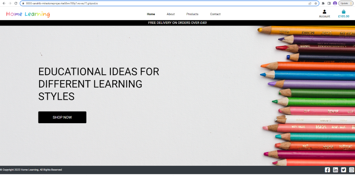

<h1 align="center">Home Learning</h1>

[View the live project here.](https://milestone-p4.herokuapp.com/)

This is an ecommerce site, selling learning curricula to parents and teachers. It is designed to be responsive and accessible on a range of devices, making it easy to navigate for potential customers.

<h2 align="center"></h2>

## User Experience (UX)

-   ### User stories

-    [User stories part 1](media/userstories1.png)
-    [User stories part 2](media/userstories2.png)

-   ### Design
    -   #### Colour Scheme
        -   White is the predominant colour on the site, creating a clean and clear background.  The rainbow-coloured logo design and multi-coloured pencils in the hero image are eye-catching and represent the different styles of learning:
            - Red is physical
            - Orange is for passion and fun
            - Yellow is creative and emotional
            - Green represents nature and the environment
            - Blue is logical and intellectual
            - Purple throws in a bit of luxury and decadence
    -   #### Typography
        -   Roboto is the main font used throughout the whole website with Sans Serif as the fallback font in case for any reason the font isn't being imported into the site correctly. It is a clean font which clearly communicates a feeling of professionalism and authenticity to the user.  Fuzzy Bubble is used as the logo font to offer a friendly and welcoming feel to the company.
    -   #### Imagery
        -   The white background of the hero image allows for a clean and clear layout, with the bold and colourful side image catching the user's attention. The image of pencils is directly linked to the educational content being sold on the site and so is relevant and descriptive.

*   ### Wireframes

    -   [Home](media/home.png)
    -   [About](media/about.png)
    -   [Products](media/products.png)
    -   [Product Details](media/product_details.png)
    -   [Contact](media/contact.png)
    -   [Shopping Bag](media/bag.png)
    -   [Checkout](media/checkout.png)

*   ### Database Schema
    [Entity Relationship Diagram](media/er_diagram_mp4.png)


## Features

-   Responsive on all device sizes

-   Interactive elements

-   Stripe payments

-   Registered users can leave reviews for products.  These can help future customers to make a more informed choice about their purchases.

-   A contact form is provided so that users can get in touch with the company directly through the site.

## Future Features

-   Create a messaging service for logged in users via the Account tab.  When registered users submit a contact form it will be stored in their Account as part of the messaging service.

-   The data from the contact form is currently only stored in the database.  Create a "receive a copy by email" option so unregistered users can have a record of the communication.

-   Improve the review setup:   -   Add a rating input in the reviews form and then calculate an average user rating for each product.
                                -   Only allow a user to submit a single review for each product.
                                -   Only allow users who have previously bought a product to rate and review it.


## Technologies Used

### Languages Used

-   [HTML5](https://en.wikipedia.org/wiki/HTML5)
-   [CSS3](https://en.wikipedia.org/wiki/Cascading_Style_Sheets)
-   [Javascript](https://www.javascript.com/)
-   [Python](https://www.python.org/)

### Frameworks, Libraries & Programs Used

1. [Bootstrap 4.4.1:](https://getbootstrap.com/docs/4.4/getting-started/introduction/)
    - Bootstrap was used to assist with the responsiveness and styling of the website.
1. [Hover.css:](https://ianlunn.github.io/Hover/)
    - Hover.css was used on buttons throughout the site
1. [Google Fonts:](https://fonts.google.com/)
    - Google fonts were used to import the 'Fuzzy Bubble' and 'Roboto' fonts into the style.css file which are used on all pages throughout the project.
1. [Font Awesome:](https://fontawesome.com/)
    - Font Awesome was used on all pages throughout the website to add icons for aesthetic and UX purposes.
1. [jQuery:](https://jquery.com/)
    - jQuery came with Bootstrap to make the navbar responsive but was also used for the smooth scroll function in JavaScript.
1. [Git](https://git-scm.com/)
    - Git was used for version control by utilizing the Gitpod terminal to commit to Git and Push to GitHub.
1. [GitHub:](https://github.com/)
    - GitHub is used to store the projects code after being pushed from Git.
1. [Balsamiq:](https://balsamiq.com/)
    - Balsamiq was used to create the [wireframes](https://github.com/) during the design process.
1. [Kaggle:](https://www.kaggle.com/)
1. [ElephantDQL](https://www.elephantsql.com/)
    - PostgreSQL database
1. [Stripe](https://stripe.com/gb)
    - Stripe is used to manage payments
1. [Heroku](https://www.heroku.com/)
    - Heroku was used to deploy the site
1. [Django](https://www.djangoproject.com/)
    - Django framework.

## Testing

The W3C Markup Validator and W3C CSS Validator Services were used to validate every page of the project to ensure there were no syntax errors in the project.

-   [W3C Markup Validator]() - [Results](https://github.com/)
-   [W3C CSS Validator](https://jigsaw.w3.org/css-validator/#validate_by_input) - [Results](https://jigsaw.w3.org/css-validator/validator?uri=https%3A%2F%2Fmilestone-p4.herokuapp.com%2F&profile=css3svg&usermedium=all&warning=1&vextwarning=&lang=en)
-   Javascript validator
-   Lighthouse test on mobile site - [Results](media/lighthouse_mobile.png)
-   Lighthouse test on desktop site - [Results](media/lighthouse_desktop.png)
-   

### Testing User Stories from User Experience (UX) Section

-   Testing user stories information:
    -   [User stories part 1](media/userstories1completed.png)
    -   [User stories part 2](media/userstories2completed.png)

### Further Testing

-   The Website was tested on Google Chrome, Microsoft Edge and Safari browsers.
-   The website was viewed on a variety of devices such as Desktop, Laptop, iPhone7, iPhone 8 & Galaxy Fold.
-   A large amount of testing was done to ensure that all pages were linking correctly.
-   Friends and family members were asked to review the site and documentation to point out any bugs and/or user experience issues.  They created test accounts, reviews, orders and enquiries to make sure the site was working properly.

### Problems Encountered

-   Trying to obtain cards of the same size with the same image dimensions but with good proportions across the range of screen sizes took time.

-   The contact form was working locally but when posting the form on the deployed app it was generating a 500 error.  After hours of frustration and tourbleshooting/attempted fixes, I contacted Tutor Support, who suggested migrating with a heroku prefix and all was solved.

-   Originally the review form had a user field which I wanted to populate with the logged in user's username and for it to be readonly.  After attempting many different combinations of form, view and html and not quite managing to make any of them work as needed, I decided to place the username outside of the form which had the desired result.

-   The edit review form caused some issues.  I was orginally declaring a specific instance of the form, editing the form data and then saving it to the database.  There were lots of errors!  I eventually realised that the form didn't contain all the fields in the model so it wasn't able to match the form data to the database record and I needed to update only the specific fields from the form.  In addition to that, when I edited the instance of the form and pressed submit the form was being declared invalid so I had to move the form declarations around a bit to make it work.  During this process, I discovered how to use logging to determine where the error was coming from.

### Known Bugs

## Deployment

### Heroku

The project was deployed to Heroku using [this](https://devcenter.heroku.com/articles/git) method, summarized here...

1. Log in to GitHub and locate the [GitHub Repository](https://github.com/)
2. Log in to [Heroku](https://heroku.com/) and create your app.
3. Link your heroku app to your github repo.
4. Allow automatic deployment to GitHub.

### AWS

The static files need to be deployed separately [aws](https://aws.amazon.com/) was used:

1. Create an S3 bucket.
2. Create a group and add a full s3 policy, specifying the location ARM.
3. Create a user, allowing programmatic access.
4. Connect to django by install boto3 and django-storages.
5. Upload the site images and static files to the S3 bucket.

### ElephantSQL

To transfer the database:

1. Login/Register at [ElephantSQL](ElephantSQL.com).
2. Create a New Instance.
3. Use the terminal to install dj_database_url and psycopg2.
4. Import os and dj_database_url into settings.py.
5. Comment out the sqite3 database connection and add a connection to ElephantSQL with 'default': dj_database_url.parse('your-database-url-here')
6. Migrate
7. Load the categories:  python3 manage.py loaddata categories
8. Load the products:  python3 manage.py loaddata products
9. Create a superuser
10. Delete the ElephantSQL connection in settings.py and reinstate the sqlite3 connection.


### Forking the GitHub Repository

By forking the GitHub Repository we make a copy of the original repository on our GitHub account to view and/or make changes without affecting the original repository by using the following steps...

1. Log in to GitHub and locate the [GitHub Repository](https://github.com/)
2. At the top of the Repository (not top of page) just above the "Settings" Button on the menu, locate the "Fork" Button.
3. You should now have a copy of the original repository in your GitHub account.

### Making a Local Clone

1. Log in to GitHub and locate the [GitHub Repository](https://github.com/)
2. Under the repository name, click "Clone or download".
3. To clone the repository using HTTPS, under "Clone with HTTPS", copy the link.
4. Open Git Bash
5. Change the current working directory to the location where you want the cloned directory to be made.
6. Type `git clone`, and then paste the URL you copied in Step 3.

```
$ git clone https://github.com/YOUR-USERNAME/YOUR-REPOSITORY
```

7. Press Enter. Your local clone will be created.

```
$ git clone https://github.com/YOUR-USERNAME/YOUR-REPOSITORY
> Cloning into `CI-Clone`...
> remote: Counting objects: 10, done.
> remote: Compressing objects: 100% (8/8), done.
> remove: Total 10 (delta 1), reused 10 (delta 1)
> Unpacking objects: 100% (10/10), done.
```

Click [Here](https://help.github.com/en/github/creating-cloning-and-archiving-repositories/cloning-a-repository#cloning-a-repository-to-github-desktop) to retrieve pictures for some of the buttons and more detailed explanations of the above process.

## Credits

### Code

-   [Bootstrap4](https://getbootstrap.com/docs/4.4/getting-started/introduction/): Bootstrap Library used throughout the project mainly to make site responsive using the Bootstrap Grid System.

-   Rainbow gradient used for the logo-font class was taken from [We Learn to Code](https://welearncode.com/rainbow-text/)

-   CSS code taken from [Bulma](https://bulma.io/) to size and position font awesome icons

-   Footer positioning inspired by an [article on DEV site](https://dev.to/niorad/keeping-the-footer-at-the-bottom-with-css-grid-15mf0)

### Content

-   All content was written by the developer with inspiration taken from the Code Institute Walkthrough Project.

-   Code Institute ReadMe template used to structure ReadMe.

-   Psychological properties of colours text in the README.md was found [here](http://www.colour-affects.co.uk/psychological-properties-of-colours)

### Media

-   Website background is a mirrored version of a photo by [Kelly Tungay](https://unsplash.com/@kellitungay?utm_source=unsplash&utm_medium=referral&utm_content=creditCopyText) on [Unsplash](https://unsplash.com/s/photos/learning?utm_source=unsplash&utm_medium=referral&utm_content=creditCopyText)

-   Pencils photo by [Jess Bailey](https://unsplash.com/@jessbaileydesigns?utm_source=unsplash&utm_medium=referral&utm_content=creditCopyText) on [Unsplash](https://unsplash.com/s/photos/learning?utm_source=unsplash&utm_medium=referral&utm_content=creditCopyText)

-   Puzzle photo by [Hans-Peter Gauster](https://unsplash.com/@sloppyperfectionist?utm_source=unsplash&utm_medium=referral&utm_content=creditCopyText) on [Unslpash](https://unsplash.com/s/photos/learning?utm_source=unsplash&utm_medium=referral&utm_content=creditCopyText)

-   Calculator photo by [AnoushkaP](https://unsplash.com/@_purianoushka?utm_source=unsplash&utm_medium=referral&utm_content=creditCopyText) on [Unsplash](https://unsplash.com/s/photos/maths?utm_source=unsplash&utm_medium=referral&utm_content=creditCopyText)

-   Pyramids photo by [Shotaro Hamasaki](https://unsplash.com/ja/@_shography?utm_source=unsplash&utm_medium=referral&utm_content=creditCopyText) on [Unsplash](https://unsplash.com/s/photos/pyramids%27?utm_source=unsplash&utm_medium=referral&utm_content=creditCopyText)

-  Globe Photo by [Amy Humphries](https://unsplash.com/@amyjoyhumphries?utm_source=unsplash&utm_medium=referral&utm_content=creditCopyText) on [Unsplash](https://unsplash.com/s/photos/globe?utm_source=unsplash&utm_medium=referral&utm_content=creditCopyText)


-  Chemistry Photo by [Raghav Bhasin](https://unsplash.com/@myphotocave?utm_source=unsplash&utm_medium=referral&utm_content=creditCopyText) on [Unsplash](https://unsplash.com/s/photos/chemistry?utm_source=unsplash&utm_medium=referral&utm_content=creditCopyText)
  

-  Computing Photo by [Markus Spiske](https://unsplash.com/@markusspiske?utm_source=unsplash&utm_medium=referral&utm_content=creditCopyText) on [Unsplash](https://unsplash.com/s/photos/science?utm_source=unsplash&utm_medium=referral&utm_content=creditCopyText)

-  Dice Photo by [Jonathan Petersson](https://unsplash.com/@grizzlybear?utm_source=unsplash&utm_medium=referral&utm_content=creditCopyText) on [Unsplash](https://unsplash.com/s/photos/bingo?utm_source=unsplash&utm_medium=referral&utm_content=creditCopyText)

- Mystery Photo by [Media Modifier](https://unsplash.com/@mediamodifier?utm_source=unsplash&utm_medium=referral&utm_content=creditCopyText) on [Unsplash](https://unsplash.com/s/photos/detective?utm_source=unsplash&utm_medium=referral&utm_content=creditCopyText)
  
  
  
  
  
  

### Acknowledgements

-   My Mentor for continuous helpful feedback.

-   Tutor support at Code Institute for their support.